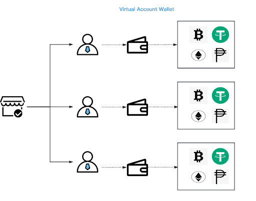
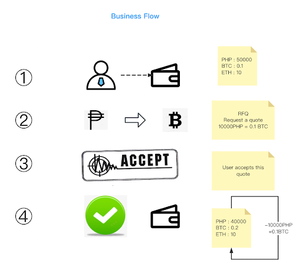

Fiat-Crypto Conversion Related Endpoints
========================================

The methods described in this section enable real-time currency conversion between fiat and crypto. 
Each endpoint facilitates a specific use case. Users only need to select the current currency and target currency, then accept the quote, and quickly obtain the target currency.

System Integration
-----------------

Retrieving Supported Trading Pairs
~~~~~~~~~~~~~~~~~~~~~~~~

This constantly updated endpoint returns all available trading pairs. Response details include the minimum and maximum source amounts and the source currency precision in decimal places. 

**API Type:** HTTP

**Method:** POST

**URL:** /merchant-api/convert/get-supported-trading-pairs

Request
~~~~~~~

.. list-table::
   :header-rows: 1
   
   * - Parameter
     - Layout
     - Required
     - Description
   * - userId
     - Request body
     - no
     - User ID in Coins

Response
~~~~~~~

.. code-block:: JSON

  {
      "status": 0,
      "error": "OK",
      "data":[
          {
              "sourceCurrency":"PHP",
              "targetCurrency":"BTC",
              "minSourceAmount":"1000",
              "maxSourceAmount":"15000",
              "precision" : "2"           
          },
          {
              "sourceCurrency":"BTC",
              "targetCurrency":"PHP",
              "minSourceAmount":"0.0001",
              "maxSourceAmount":"0.1",
              "precision" : "8"
          },
          {
              "sourceCurrency":"PHP",
              "targetCurrency":"ETH",
              "minSourceAmount":"1000",
              "maxSourceAmount":"18000",
              "precision" : "2"
          },
          {
              "sourceCurrency":"ETH",
              "targetCurrency":"PHP",
              "minSourceAmount":"0.003",
              "maxSourceAmount":"4.2",
              "precision" : "8"
          }
      ]
  }

Fetching a Quote
~~~~~~~~~~~~~~~~~~~~~~~~

This endpoint returns a quote for specified ``sourceCurrency`` and ``targetCurrency``.

**API Type:** HTTP

**Method:** POST

**URL:** /merchant-api/convert/get-quote

Request
~~~~~~~

.. list-table::
   :header-rows: 1
   
   * - Parameter
     - Layout
     - Required
     - Description
   * - sourceCurrency
     - Request body
     - yes
     - The currency the user holds
   * - targetCurrency
     - Request body
     - yes
     - The currency the user would like to obtain
   * - sourceAmount
     - Request body
     - yes
     - The amount of the source currency    

Sample request
~~~~~~~

**NOTE**: To convert PHP, use 0.1 BTC

.. code-block:: JSON

  {
      "sourceCurrency":"BTC",
      "targetCurrency": "PHP",
      "sourceAmount" : "0.1"
  }

Response
~~~~~~~

.. code-block:: JSON

  {
     "status": 0,
      "error": "OK",
      "data": {
          "quoteId": "2182b4fc18ff4556a18332245dba75ea",
          "sourceCurrency": "BTC",
          "targetCurrency": "PHP",
          "sourceAmount": "0.1",
          "price": "59999",             //1BTC=59999PHP
          "targetAmount": "5999",       //The amount of PHP the user holds
          "expiry": "10"
      }
  }

Accepting a Quote
~~~~~~~~~~~~~~~~~~~~~~~~

This endpoint accepts the quote obtained using the ``get-quote`` method.

**API Type:** HTTP

**Method:** POST

**URL:** /openapi/convert/v1/accept-quote

Request
~~~~~~~

.. list-table::
   :header-rows: 1
   
   * - Parameter
     - Layout
     - Required
     - Description
   * - userId
     - Request body
     - yes
     - User ID in Coins
   * - sourceCurrency
     - Request body
     - yes
     - The currency the user holds
   * - targetCurrency
     - Request body
     - yes
     - The currency the user would like to obtain
   * - sourceAmount
     - Request body
     - yes
     - The amount of the source currency
   * - quoteId
     - Request body
     - yes
     - The ID assigned to the quote    

Response
~~~~~~~

.. code-block:: JSON

  {
      "status": 0,
      "data": {
          "orderId" : "49d10b74c60a475298c6bbed08dd58fa"
          "success": true
      },
      "error": "ok"
  }

Retrieving the Current User’s Order History
~~~~~~~~~~~~~~~~~~~~~~~~

This endpoint accepts the quote obtained using the ``get-quote`` method.

**API Type:** HTTP

**Method:** POST

**URL:** openapi/convert/v1/query-order-history

Request
~~~~~~~

.. list-table::
   :header-rows: 1
   
   * - Parameter
     - Layout
     - Required
     - Description
   * - userId
     - Request body
     - yes
     - User ID in Coins
   * - startTime
     - Request body
     - no
     - The starting point of the required period. If no period is defined, the entire order history is returned.
   * - endTime
     - Request body
     - no
     - The end point of the required period. If no period is defined, the entire order history is returned.
   * - page
     - Request body
     - no
     - Page number
   * - size
     - Request body
     - no
     - Page size    

Response
~~~~~~~

.. code-block:: JSON

   {
       "status": 0,
       "error": "OK",
       "data": [
           {
               "id": 1048,
               "orderId": "49d10b74c60a475298c6bbed08dd58fa",
               "userId": "1304304339091773722",
               "quoteId": "cfbe49acf56b43a698d99ca470658a5c",
               "sourceCurrency": "BTC",
               "targetCurrency": "PHP",
               "sourceAmount": "0.00014252",
               "targetAmount": "131.1432432",
               "price": "920174.31378052",
               "fee": "0",
               "status": "SUCCESS",
               "createdAt": "1672283052000",
               "errorCode": "",
               "errorMessage": ""
           },
           {
               "id": 1032,
               "orderId": "ad3bb743e60747a8a57c2d33317c3149",
               "userId": "1304304339091773722",
               "quoteId": "5217a22fdbf044ecaf147fb99bc00be6",
               "sourceCurrency": "ETH",
               "targetCurrency": "BTC",
               "sourceAmount": "0.01583701",
               "targetAmount": "0.024643",
               "price": "1.55603867",
               "fee": "0",
               "status": "FAILED",
               "createdAt": "1672025632000",
               "errorCode": "",
               "errorMessage": ""
           },
           {
               "id": 1031,
               "orderId": "49678eef7b3b4003ab3552141bb2d2dd",
               "userId": "1304304339091773722",
               "quoteId": "ac04e42b37fd439cb06fb2d8b5b21559",
               "sourceCurrency": "ETH",
               "targetCurrency": "BTC",
               "sourceAmount": "0.01584514",
               "targetAmount": "0.024643",
               "price": "1.55524028",
               "fee": "0",
               "status": "FAILED",
               "errorMessage" : "Insufficient balance"
               "createdAt": "1672025122000",
               "errorCode": "",
               "errorMessage": ""
           },
           {
               "id": 1024,
               "orderId": "69e4b2d166f24155b9f2221999a5271c",
               "userId": "1304304339091773722",
               "quoteId": "671f88b5330043949f6dfda222bcd5f5",
               "sourceCurrency": "PHP",
               "targetCurrency": "XRP",
               "sourceAmount": "43.46",
               "targetAmount": "1",
               "price": "0.02300966",
               "fee": "0",
               "status": "SUCCESS",
               "createdAt": "1671800356000",
               "errorCode": "",
               "errorMessage": ""
           },
           {
               "id": 1023,
               "orderId": "25a9b92bcd4d4b2598c8be97bc65b466",
               "userId": "1304304339091773722",
               "quoteId": "1ecce9a7265a4a329cce80de46e2c583",
               "sourceCurrency": "BTC",
               "targetCurrency": "PHP",
               "sourceAmount": "0.11",
               "targetAmount": "4466.89275956",
               "price": "40608.115996",
               "fee": "0",
               "status": "SUCCESS",
               "createdAt": "1671797993000",
               "errorCode": "",
               "errorMessage": ""
           }
       ],
       "total": 23
   }

