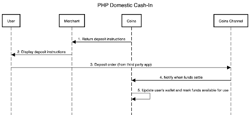

Fiat and E-Wallet Related Endpoints
======================

PHP Cash-In
-----------
As shown in the diagram below, the PHP cash-in process includes the following steps:

   
InstaPay/PESONet Cash-In
~~~~~~~~~~~~~~~~~~~~~~~~
This module is used for the e-wallet/bank (InstaPay/PESONet) implementation of cash-in operations.

Retrieving User Cash-In Account Information
~~~~~~~~~~~~~~~~~~~~~~~~

**Method:** GET

**URL:** /merchant-api/fiat/cash-in/info?userId=13530199609

**Idempotent:** True

Request
~~~~~~~

.. list-table::
   :header-rows: 1
   
   * - Parameter
     - Layout
     - Required
     - Description
   * - userId
     - Request body
     - yes
     - User ID in the Merchant’s platform

Response
~~~~~~~

.. code-block:: JSON

    "userId" : "1304304339091773722",
    "registerStatus" : "success",
    "kycStatus" : "lv2"
Method: GET
URL: /merchant-api/fiat/cash-in/info?userId=13530199609
Idempotent: True
   
