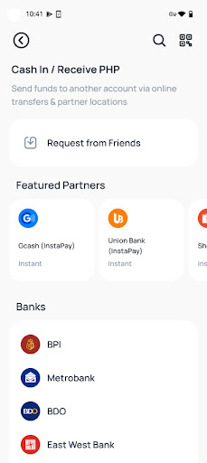

Fiat and E-Wallet Related Endpoints
======================

PHP Cash-In
-----------
As shown in the diagram below, the PHP cash-in process includes the following steps:

.. image::
   PHP_dom_cashin.png
   
InstaPay/PESONet Cash-In
~~~~~~~~~~~~~~~~~~~~~~~~
This module is used for the e-wallet/bank (InstaPay/PESONet) implementation of cash-in operations.

Retrieving User Cash-In Account Information
~~~~~~~~~~~~~~~~~~~~~~~~

**Method:** GET

**URL:** /merchant-api/fiat/cash-in/info?userId=13530199609

**Idempotent:** True

Request
~~~~~~~

.. list-table::
   :header-rows: 1
   
   * - Parameter
     - Layout
     - Required
     - Description
   * - userId
     - Request body
     - yes
     - User ID in the Merchant’s platform

Response
~~~~~~~

.. code-block:: JSON

    "userId" : "1304304339091773722",
    "registerStatus" : "success",
    "kycStatus" : "lv2"

E-wallet Transfer steps
~~~~~~~

1. Select send money to a bank account on your wallet app.
2. Choose InstaPay/PESONet as transfer option.
3. Enter the account details and enter the amount you want to cash in.

   - Bank: DCPay Philippines/Coins.ph

   - Account Name: Your full name 

   - Account Number:  Your union ID number (provided by Coins to route cash-ins to the appropriate merchant and end user account; e.g., “0200000002”)
4. The amount will be credited to your PHP balance once the transaction has been processed.

Online bank Transfer steps
~~~~~~~
1. Choose to transfer funds to another bank account.
2. Choose InstaPay/PESONet as transfer option.
3. Enter the account details below and enter the amount you want to cash in.

   - Bank: DCPay Philippines/Coins.ph
   
   - Account Name: Your full name
   
   - Account Number: Your union ID number (provided by Coins to route cash-ins to the appropriate merchant and end user account; e.g. “0200000002”)
4. The amount will be credited to your PHP balance once the transaction has been processed.

Special Instructions
~~~~~~~

1. Supports E-wallet/banks see transaction/fiat/query-supported-channels endpoint
2. Each merchant has a consistent and different merchant prefix code, and union ID number designated to their end user account in order to route an incoming InstaPay or PESONet transfer to the correct merchant’s end user account.

Passive cash-in process description
~~~~~~~
InstaPay/PESONet cash-in operations need to be initiated from a third-party bank or e-wallet. The specific process is delineated below (Coins.ph e-wallet UI appears only as an example):

1. Before initiating a cash-in, you need to query whether the channel is available (using the ``transaction/fiat/query-supported-channels`` endpoint).
2. Initiate a cash-in application for the Merchant in a third party application (e.g. Maya, GCash, etc.) To cash-in from the Merchant app, follow the instructions in the sample above.
3. Coins will then process Merchant cash-in requests from banks or e-wallets via InstaPay or PESONet.
4. A notification of a successful cash-in is sent via a webhook.
5. The Merchant can query for the corresponding Coins user’s cash-in order history and balance.

PHP Cash-Out
------------
The PHP cash-out process is launched when a user initiates a withdrawal and the withdrawal request is passed from Merchant to Coins, who then submits it to the payment channel. Upon receiving a success notification from the payment channel, Coins debits the user’s wallet.

InstaPay/PESONet Cash-Out
~~~~~~~~~~~~~~~~~~~~~~~~
This endpoint is used to provide InstaPay/PESONet cash-outs. Note that this operation is asynchronous.

**Method:** POST

**URL:** /merchant-api/transaction/fiat/cash-out

**Idempotent:** True

Request
~~~~~~~

.. list-table::
   :header-rows: 1
   
   * - Parameter
     - Layout
     - Required
     - Description
   * - userId
     - Request body
     - yes
     - User ID in the Merchant’s platform
   * - amount
     - Request body
     - yes
     - Cash-out amount
   * - currrency
     - Request body
     - yes
     - PHP
   * - channelName
     - Request body
     - yes
     - Cash-out channel (InstaPay or PESONet)
   * - recipientName
     - Request body
     - yes
     - Name of payee/recipient
   * - recipientBank
     - Request body
     - yes
     - Receiving bank or e-wallet identification number. Can be found in the ``transactionSubject`` attribute in the response to the Fetch Supported Channels call
   * - recipientAccountNumber
     - Request body
     - yes
     - Recipient account
   * - internalOrderId
     - Request body
     - yes
     - Merchant’s reference number

Upon completion, the request returns the internal and external IDs of the newly created order and its current status. 

Response
~~~~~~~

.. code-block:: JSON

   {
           "externalOrderId":"D202208213327", // Coins.ph reference number
           "internalOrderId":"123",
           "orderStatus":"pending" // pending, success, failed
   }

PHP Wallet-to-Wallet Transfer
------------------------------
A wallet-to-wallet (P2P) fund transfer involves the following steps:
A user initiates the request and the transfer request is passed from Merchant to Coins. Upon receiving the request, Coins executes the transfer and updates the user’s wallet.
For endpoint details, please refer to P2P Transfer.

   
Fetching Supported Channels
~~~~~~~~~~~~~~~~~~~~~~~~
This endpoint fetches the channels that Coins Access supports for various transactions.

**Method:** POST

**URL:** /merchant-api/transaction/fiat/query-supported-channels

**Idempotent:** True

Request
~~~~~~~

.. list-table::
   :header-rows: 1
   
   * - Parameter
     - Layout
     - Required
     - Description
   * - userId
     - Request body
     - yes
     - User ID in the Merchant’s platform   
   * - transactionType
     - Request body
     - yes
     - Cash-in/cash-out
   * - currency
     - Request body
     - yes
     - PHP

Response
~~~~~~~

.. code-block:: JSON

   {
       "data":[
           {
               "transactionChannel":"INSTAPAY", // channel code
               "transactionChannelName":"Instapay", // channel name
               "transactionSubject":"gcash", // bank or e-wallet code
               "transactionSubjectName":"GCash", // bank or e-wallet name
               "transactionType":"-1", // 1: cash-in; -1: cash-out
               "channelIcon":"http://www.icon.com/instapay", //channel icon
               "subjectIcon":"http://www.icon.com/gcash",// bank or e-wallet icon
               "Maximum":"10000000", // Single ratio maximum limit 
               "minimum":"100000",  // Single ratio minimum limit 
               "dailyLimit":"100000", 
               "monthlyLimit":"100000",
               "annualLimit":"100000",
               "Precision":"2",
               "maxWithdrawBalance" : "100000", // The maximum balance that the user can withdraw at a time
               "status" : "1" // 1: available, -1: unavailable

           },
           {
               "transactionChannel":"PESONET",
               "transactionChannelName":"Pesonet",
               "transactionSubject":"maya",
               "transactionSubjectName":"Maya",
               "transactionType":"-1",
               "channelIcon":"http://www.icon.com/instapay",
               "subjectIcon":"http://www.icon.com/maya",
               "maximum":"10000000",
               "minimum":"100000",
               "dailyLimit":"100000",
               "monthlyLimit":"100000",
               "annualLimit":"100000",
               "precision":"2",
               "maxWithdrawBalance" : "100000",
               "status" : "1"
           }
       ],
       "status":"0",
       "error": "ok"
   }

Fetching Channel Payment Details
~~~~~~~~~~~~~~~~~~~~~~~~
This endpoint fetches the details of a specific channel.

**Method:** POST

**URL:** /merchant-api/transaction/query-channel-payment-details

**Idempotent:** True

Request
~~~~~~~

.. list-table::
   :header-rows: 1
   
   * - Parameter
     - Layout
     - Required
     - Description
   * - userId
     - Request body
     - yes
     - User ID in the Merchant’s platform   
   * - transactionType
     - Request body
     - yes
     - Cash-in/cash-out
   * - channelCode
     - Request body
     - yes
     - Channel code, e.g., Instapay

Response
~~~~~~~

.. code-block:: JSON

   {
       "bank" : "UnionBank",
       "accountNo" : "432324153232"
   }

