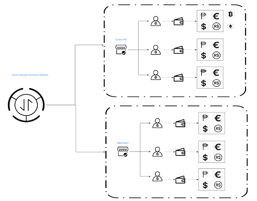

.. _overview:

Overview
========

Coins.ph offers a white label e-wallet API that allows Filipino users who receive financial services offered by other Merchants to take full control and ownership of their digital assets. In addition, our wallet is reinforced with market-leading features to achieve institutional-grade security, ease-of-use, and unsurpassed performance.

Coins Access is an international financial platform with the following main capabilities:

- Account opening with comprehensive adherence to the standard KYC (Know Your Customer) processes of sharing and check-and-query.
- PHP depositing and withdrawal for all the different payment methods supported by Coins, such as InstaPay, PESONet, etc.
- Internal wallet-to-wallet transfers.
- Local live payments, such as mobile phone top-up, bill payments, etc.
- Transaction reconciliations synchronized between the Merchant and Coins with consecutive ledger updates.
Coins Access Account System
---------------------------

As illustrated in the diagram below, the Merchant’s and Coins.ph account systems and user spaces will remain completely segregated and independent. This is also applicable to the user’s KYC and account information that will not be shared between different “merchant” accounts even though it refers to the same individual.


Sure, here's the updated text:

Coins Access Open API
---------------------------
The Coins Access Open API provides a set of APIs that allow merchants to integrate with the Coins.ph platform and offer digital financial services to their customers. The APIs include account opening, depositing and withdrawal, wallet-to-wallet transfers, and local live payments.

API Sandbox
***********
The Coins Access API sandbox allows the Merchant’s developers to imitate the characteristics of a production environment in a dedicated testing environment where they can create simulated responses from all APIs the application relies on.

Security Protocol
*****************
To ensure the security and integrity of the Coins Access Open API, the following security protocols must be implemented:

- The server API must be implemented as an HTTPS endpoint on both sides.
- All content must be encoded with the UTF-8 character encoding system.
- The request body must be in JSON format.
- The encryption method is SHA256 with RSA signature.
- Private key is used for generating signatures and the public key is used for verifying signatures.

Signature
*********
Here's an example code snippet for generating a signature using the private key:

```java
/**
* @param srcData    original data
* @param privateKey
* @return sign result
*/
public static String sign(String srcData, PrivateKey privateKey) throws Exception {
   byte[] keyBytes = privateKey.getEncoded();
   PKCS8EncodedKeySpec keySpec = new PKCS8EncodedKeySpec(keyBytes);
   KeyFactory keyFactory = KeyFactory.getInstance("RSA");
   PrivateKey key = keyFactory.generatePrivate(keySpec);
   Signature signature = Signature.getInstance("SHA256withRSA");
   signature.initSign(key);
   signature.update(srcData.getBytes());
   return new String(Base64.encodeBase64(signature.sign()));
}
```
